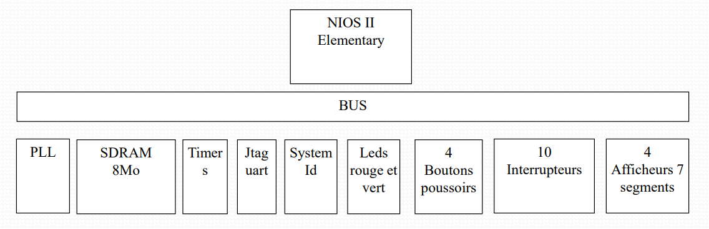

# NIOS II Processor-Based SoC on DE1 Lite FPGA

## Overview

This project demonstrates the design and implementation of a System on Chip (SoC) based on the NIOS II processor using Intel Quartus prime. The SoC is implemented on the DE1 Lite FPGA board, showcasing the capabilities of the NIOS II processor in handling various tasks.

## Features

- **NIOS II Processor**: A configurable soft processor core that can be customized to meet specific application requirements.
- **FPGA Implementation**: The SoC is fully implemented on the DE1 Lite FPGA board, providing a hands-on experience with hardware-software co-design.
- **Digital Watch**: The software component includes a digital watch functionality that displays the current time.
- **Chronometer**: A built-in chronometer feature that allows users to measure elapsed time.

## Software

The software part of the project is designed to provide a functional digital watch that includes a chronometer. Key features of the software include:

- **Real-Time Clock**: Displays the current time with hours, minutes, and seconds.
- **Chronometer Functionality**: Allows users to start, stop, and reset the timer to measure elapsed time.

### Demo Video

A demo video showcasing the chronometer functionality is available below:

